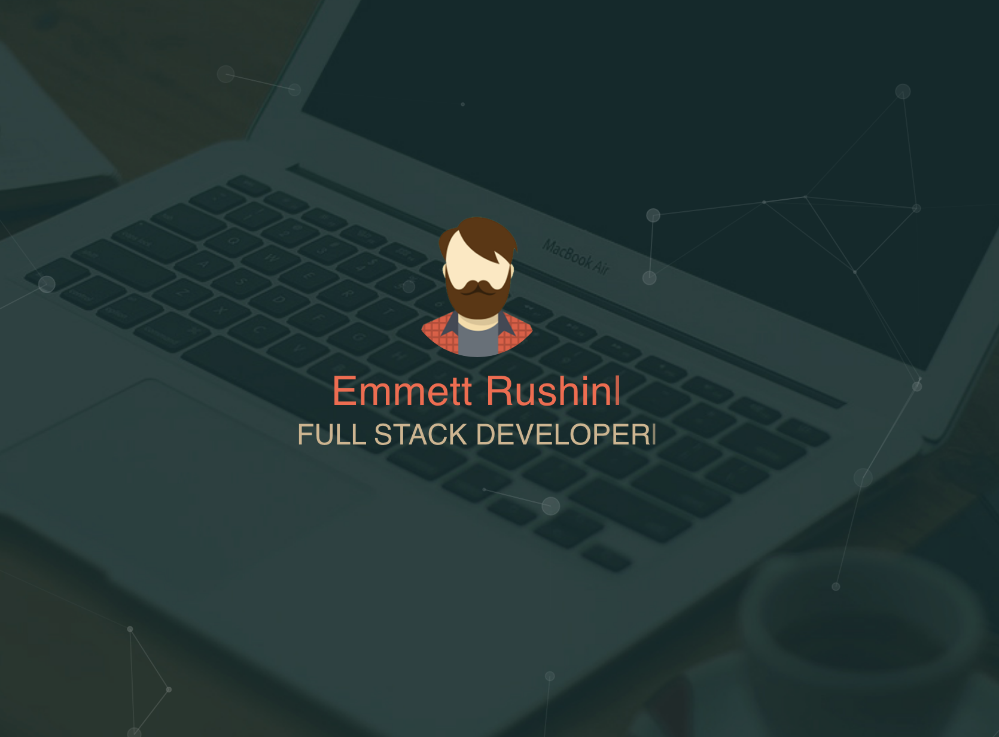
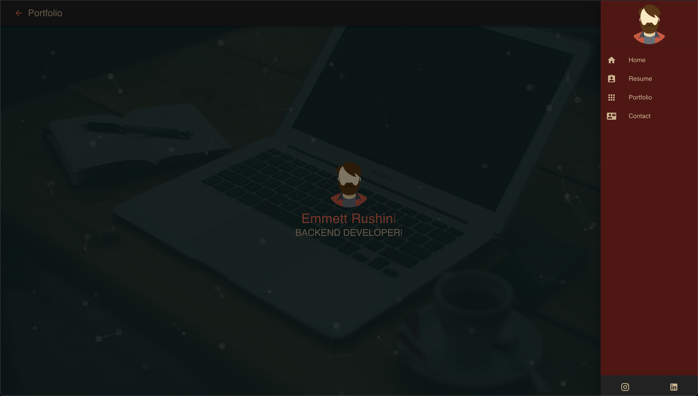
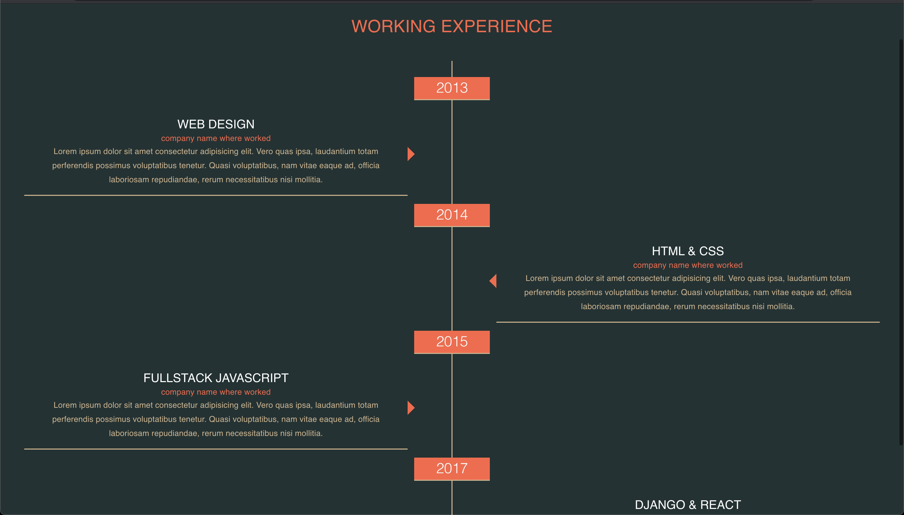
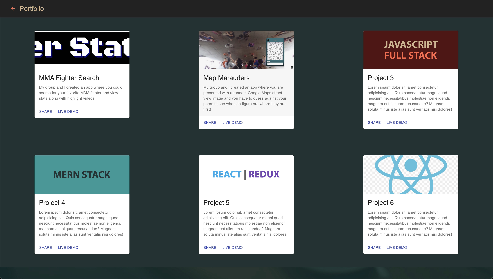

## React Portfolio

A portfolio single page application using React and Material UI


#### Installing

Clone the repository using following command or download

```
git clone https://github.com/devmahmud/material-ui-portfolio.git
```

#### To install dependency

```
npm install
```

#### To start the server

```
npm start
```

#### For Production Build

```
npm run build
```

Server will be available at http://127.0.0.1:3000 in your browser

# Project snapshot

## Home page



## Sidebar



## Resume



## Portfolio



## Author

<blockquote>
Emmett Rushin
Email: emmettrushin@gmail.com
</blockquote>
